# Panduan Admin Website RS PKU Muhammadiyah Yogyakarta

Dokumen ini menjelaskan cara mengelola konten website WordPress RS PKU Muhammadiyah Yogyakarta sebagai admin. Fokus panduan: menu dashboard, konten dinamis, custom post type, custom field, media, navigasi, dan perubahan tampilan setelah konten diedit.

> Catatan akses: URL login admin memakai login tersembunyi dari plugin WPS Hide Login. `/wp-login.php` memang dibuat tidak aktif. Minta URL login aktif ke super admin/IT, jangan sebarkan di dokumen publik.

## 1. Ringkasan Website

Website memakai WordPress dengan theme custom `rspku-theme` dan beberapa plugin custom:

- `RSPKU Core`: fungsi inti website.
- `RSPKU Custom Post Types`: tipe konten khusus seperti Dokter, Layanan, Poliklinik, Rawat Inap, Manajemen RS, dan Jurnal.
- `RSPKU Settings`: pengaturan identitas, kontak, sosial media, homepage, CTA, footer.
- `RSPKU Schema`: data schema/SEO teknis.
- `Advanced Custom Fields PRO`: field tambahan untuk konten dinamis.
- `Yoast SEO`: pengaturan SEO tiap konten.
- `TablePress`: tabel, bila dipakai untuk data terstruktur.
- `GTranslate`: terjemahan bahasa.
- `UpdraftPlus`: backup/restore.
- `WPS Hide Login`: URL login admin tersembunyi.

Data publish saat panduan dibuat:

| Tipe Konten | Jumlah Publish | Fungsi |
|---|---:|---|
| Pos/Berita | 126 | Berita, artikel edukasi, informasi RS |
| Laman | 16 | Halaman statis seperti Kontak, Tentang, Fasilitas |
| Layanan | 15 | Layanan unggulan/non-unggulan RS |
| Dokter | 100 | Profil dokter dan jadwal praktik |
| Poliklinik | 37 | Halaman/daftar poli |
| Manajemen RS | 9 | Profil direksi/manajemen |
| Rawat Inap | 1 | Fasilitas kamar/rawat inap |
| E-Jurnal | 1 | File/halaman jurnal |

## 2. Dashboard Admin

Setelah login, admin melihat menu utama WordPress di sisi kiri.

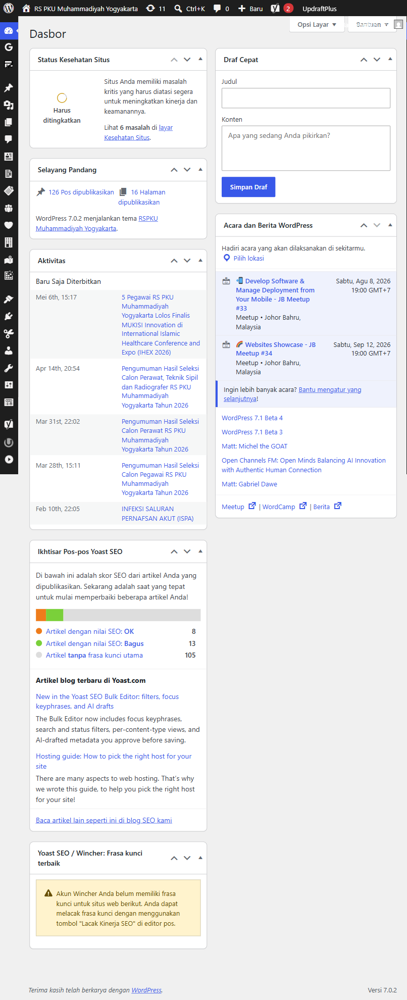

Menu penting:

| Menu | Fungsi | Dipakai Untuk |
|---|---|---|
| Dasbor | Ringkasan admin | Cek update dan status umum |
| Site Kit | Integrasi Google | Analytics/Search Console bila sudah terhubung |
| RS PKU Settings | Setting global website | Kontak, CTA, footer, homepage, branding |
| Pos | Berita/artikel | Tambah dan edit artikel |
| Media | File gambar/dokumen | Upload gambar layanan, dokter, berita, PDF |
| Laman | Halaman statis | Kontak, profil RS, fasilitas, sejarah |
| Dokter | Data dokter | Profil, foto, spesialis, jadwal praktik |
| Jurnal | Data e-jurnal | Judul, deskripsi, file dokumen |
| Layanan | Data layanan RS | Gambar, nama, deskripsi, detail layanan |
| Manajemen RS | Data manajemen | Foto, nama, jabatan |
| Poliklinik | Data poli | Gambar poli, detail poli, relasi dokter |
| Rawat Inap | Data kamar | Foto kamar, fasilitas, tarif, deskripsi |
| Tampilan > Menu | Navigasi website | Header/footer menu |
| Pengguna | Akun admin/editor | Tambah/hapus user sesuai role |
| Pengaturan | Setting WordPress | Permalink, bahasa, timezone |

## 3. Mengelola Berita/Artikel

Berita dikelola dari menu **Pos**.

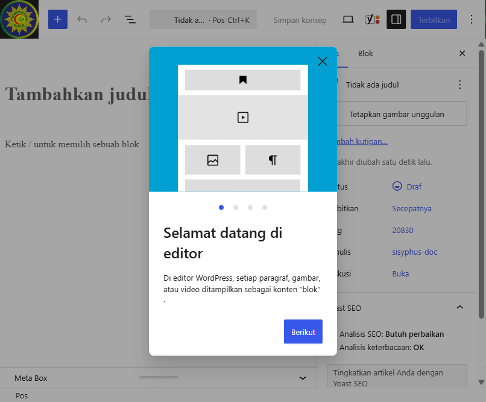

Cara tambah berita:

1. Buka **Pos > Tambah Pos**.
2. Isi judul berita.
3. Tulis isi artikel di editor.
4. Pilih kategori yang sesuai.
5. Tambahkan **Gambar Unggulan**.
6. Atur SEO di panel Yoast SEO bila perlu.
7. Klik **Pratinjau** untuk cek tampilan.
8. Klik **Terbitkan** kalau sudah final.

Hal yang wajib dicek:

- Judul jelas dan tidak terlalu panjang.
- Gambar unggulan muncul di kartu berita dan halaman detail.
- Tidak ada gambar broken di isi artikel.
- Link eksternal bisa dibuka.
- Slug/permalink pendek dan rapi.

Tips gambar berita:

- Gunakan JPG/WEBP untuk foto.
- Hindari file PNG besar untuk foto.
- Ukuran aman: di bawah 500 KB bila memungkinkan.
- Nama file pakai huruf/angka/tanda hubung, contoh `edukasi-stunting-2026.jpg`.

## 4. Mengelola Laman Statis

Laman dipakai untuk halaman seperti Kontak, Sejarah, Fasilitas, dan halaman profil lain.

Cara edit laman:

1. Buka **Laman > Semua Laman**.
2. Klik judul laman yang ingin diedit.
3. Edit judul, teks, gambar, atau blok konten.
4. Klik **Pratinjau** untuk cek frontend.
5. Klik **Perbarui**.

Contoh before/after dari halaman private untuk dokumentasi:

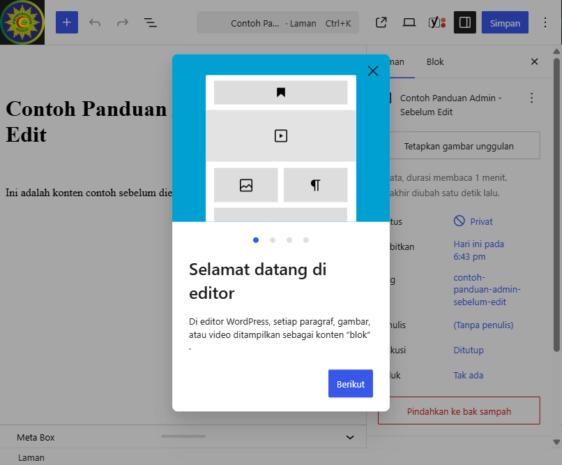

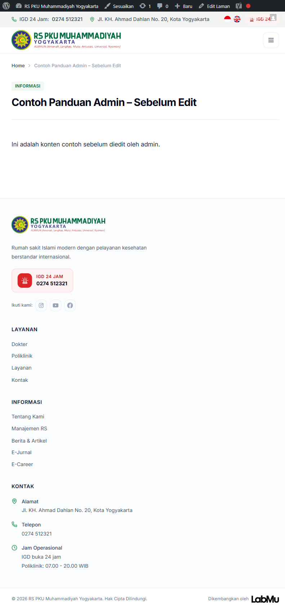

Setelah judul dan isi diubah dari admin:

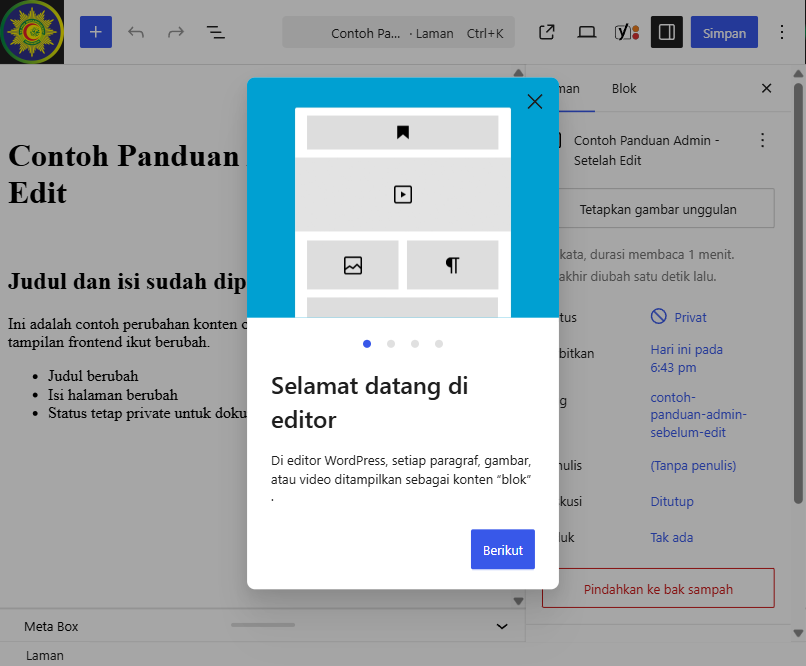

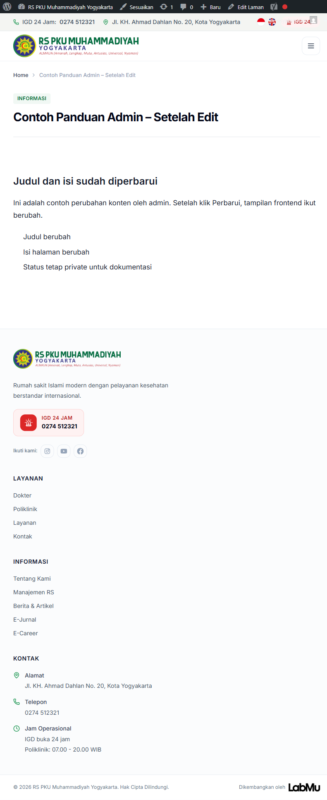

Catatan: perubahan di editor baru terlihat di frontend setelah klik **Perbarui**. Jika tampilan belum berubah, lakukan clear cache atau refresh paksa browser.

## 5. Mengelola Media

Media dikelola dari **Media > Library**.

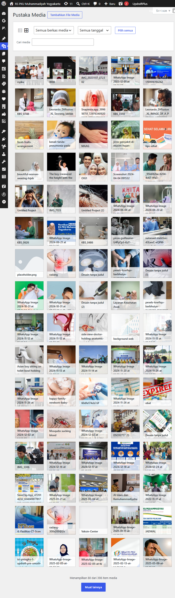

Cara upload media:

1. Buka **Media > Tambahkan File Media** atau klik upload saat memilih gambar di editor.
2. Upload file.
3. Isi alt text untuk aksesibilitas dan SEO.
4. Pakai file tersebut di berita, layanan, dokter, atau halaman.

Aturan penting:

- Jangan hapus media jika belum yakin tidak dipakai di halaman.
- Jangan rename file langsung dari server.
- Jika mengganti gambar, lebih aman upload gambar baru lalu pilih dari editor.
- Setelah upload media banyak, cek halaman terkait agar tidak ada broken image.

## 6. Mengelola Layanan

Menu **Layanan** adalah custom post type dari plugin `RSPKU Custom Post Types`. Konten ini tampil di halaman layanan dan bagian layanan unggulan/layanan terkait.

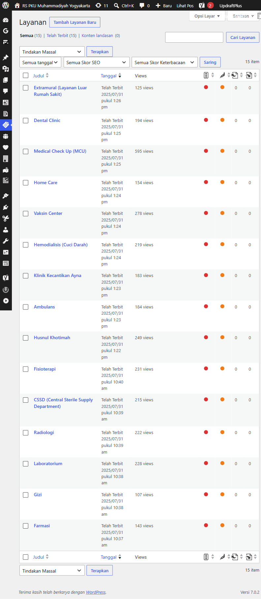

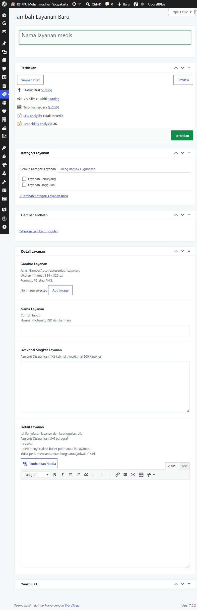

Field penting layanan:

| Field | Fungsi | Dampak di Frontend |
|---|---|---|
| Judul | Nama internal/post title | Slug dan daftar admin |
| Gambar Layanan | Gambar utama layanan | Kartu layanan dan hero/detail layanan |
| Nama Layanan | Nama yang tampil | Judul layanan di frontend |
| Deskripsi Singkat Layanan | Ringkasan layanan | Kartu/preview layanan |
| Detail Layanan | Konten lengkap | Halaman detail layanan |

Cara tambah layanan:

1. Buka **Layanan > Tambah Layanan Baru**.
2. Isi judul.
3. Pilih **Gambar Layanan**.
4. Isi **Nama Layanan**.
5. Isi **Deskripsi Singkat Layanan**.
6. Isi **Detail Layanan** dengan informasi lengkap.
7. Klik **Pratinjau**.
8. Klik **Terbitkan**.

Checklist layanan:

- Gambar utama tidak pecah dan relevan.
- Nama layanan sama dengan istilah resmi RS.
- Deskripsi singkat maksimal 1-2 paragraf.
- Detail layanan berisi manfaat, prosedur, lokasi, dan CTA bila ada.

## 7. Mengelola Dokter

Menu **Dokter** adalah custom post type untuk profil dokter.

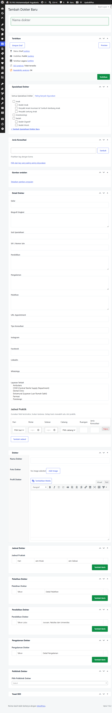

Field ACF dokter:

| Field | Fungsi |
|---|---|
| Nama Dokter | Nama yang tampil di frontend |
| Foto Dokter | Foto profil dokter |
| Profil Dokter | Deskripsi/profil singkat dokter |
| Spesialis | Kategori spesialisasi dokter |
| Jadwal Praktek | Jadwal praktik dokter, biasanya repeater |
| Pendidikan Dokter | Riwayat pendidikan |
| Pengalaman Dokter | Riwayat pengalaman |
| Pelatihan Dokter | Riwayat pelatihan |
| Pilih Poliklinik Dokter | Relasi dokter ke poliklinik |

Cara tambah/edit dokter:

1. Buka **Dokter > Tambah Dokter Baru** atau pilih dokter existing.
2. Isi judul dengan nama dokter.
3. Isi field **Nama Dokter**.
4. Upload **Foto Dokter**.
5. Isi profil, pendidikan, pengalaman, dan pelatihan bila tersedia.
6. Pilih spesialisasi dan jenis konsultasi.
7. Isi jadwal praktik.
8. Relasikan ke poliklinik bila field tersedia.
9. Klik **Perbarui/Terbitkan**.

Checklist dokter:

- Nama memakai gelar resmi.
- Foto jelas dan proporsional.
- Jadwal hari/jam benar.
- Poliklinik/spesialisasi sesuai.
- Jangan hapus dokter lama tanpa arahan; ubah status ke draft bila sementara tidak tampil.

## 8. Mengelola Poliklinik

Menu **Poliklinik** mengatur halaman/detail poli dan relasi ke dokter.

Field penting:

| Field | Fungsi |
|---|---|
| Gambar Poli | Gambar utama poli |
| Nama Poli | Nama poli di frontend |
| Deskripsi Singkat | Ringkasan poli |
| Detail Poli | Konten detail poli |
| Pilih Poliklinik Dokter | Relasi dokter ke poli |

Cara edit poliklinik:

1. Buka **Poliklinik**.
2. Pilih poli yang ingin diedit.
3. Update gambar, nama, deskripsi, atau detail.
4. Pastikan dokter terkait sudah benar.
5. Klik **Perbarui**.

## 9. Mengelola Rawat Inap

Menu **Rawat Inap** dipakai untuk fasilitas kamar.

Field penting:

| Field | Fungsi |
|---|---|
| Foto Kamar | Galeri foto kamar |
| Nama Kamar | Nama kelas/kamar |
| Kategori Kamar | Kategori kamar |
| Jumlah Tempat Tidur | Kapasitas |
| Fasilitas Kamar | Checklist fasilitas |
| Luas Kamar | Luas kamar dalam m2 |
| Deskripsi | Penjelasan kamar |
| Tarif per Hari | Harga/tarif |
| Sudah Termasuk | Item yang sudah termasuk tarif |

Checklist rawat inap:

- Pastikan tarif benar dan sudah disetujui pihak RS.
- Jangan tampilkan tarif bila belum final.
- Foto kamar harus sesuai fasilitas asli.

## 10. Mengelola Jurnal

Menu **Jurnal** dipakai untuk e-jurnal atau dokumen yang bisa dibuka/download.

Field penting:

| Field | Fungsi |
|---|---|
| Judul Jurnal | Nama jurnal |
| Deskripsi Jurnal | Ringkasan jurnal |
| File Dokumen | PDF/dokumen jurnal |

Cara tambah jurnal:

1. Buka **Jurnal > Tambah E-Jurnal Baru**.
2. Isi judul.
3. Isi deskripsi.
4. Upload file dokumen.
5. Terbitkan.

## 11. Mengelola Manajemen RS

Menu **Manajemen RS** dipakai untuk profil direksi/manajemen.

Field penting:

| Field | Fungsi |
|---|---|
| Foto Profile | Foto manajemen |
| Nama | Nama lengkap |
| Jabatan | Jabatan di RS |

Cara update:

1. Buka **Manajemen RS**.
2. Pilih profil yang ingin diedit.
3. Update foto, nama, atau jabatan.
4. Klik **Perbarui**.

## 12. RS PKU Settings

Menu **RS PKU Settings** mengatur data global website.

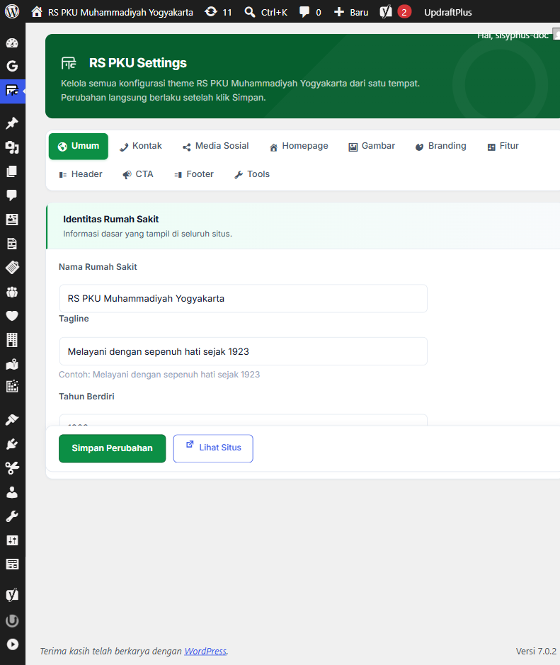

Tab yang tersedia:

| Tab | Fungsi |
|---|---|
| Umum | Identitas rumah sakit, nama, tagline, tahun berdiri |
| Kontak | Nomor telepon, email, alamat, WhatsApp |
| Media Sosial | Link Instagram, Facebook, YouTube, dll |
| Homepage | Konten dinamis homepage |
| Gambar | Gambar global/pendukung |
| Branding | Logo, warna, elemen brand |
| Fitur | Toggle/opsi fitur website |
| Header | Pengaturan header |
| CTA | Tombol ajakan seperti daftar online, WhatsApp, maps |
| Footer | Konten footer dan informasi bawah website |
| Tools | Utilitas admin khusus |

Cara update setting:

1. Buka **RS PKU Settings**.
2. Pilih tab yang ingin diedit.
3. Ubah field yang diperlukan.
4. Klik **Simpan Perubahan**.
5. Cek frontend.

Catatan penting:

- CTA eksternal harus diuji setelah diubah.
- Link Maps sebaiknya pakai URL Google Maps yang stabil.
- Link WhatsApp pakai format `https://wa.me/62...`.
- Link telepon pakai format `tel:+62...`.
- Link email pakai format `mailto:...`.

## 13. Mengelola Menu Navigasi

Menu navigasi dikelola dari **Tampilan > Menu**.

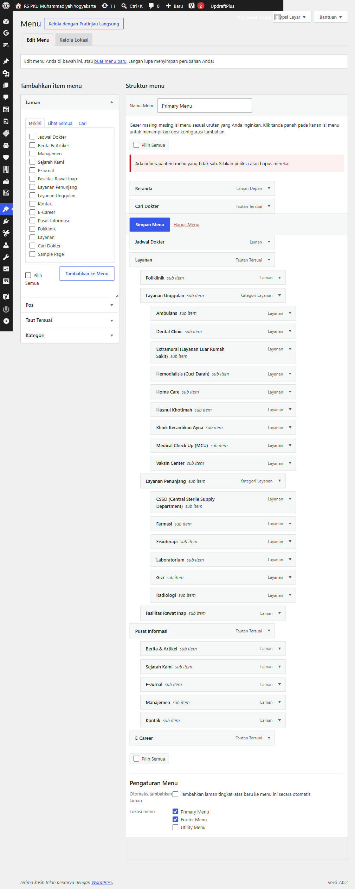

Cara edit menu:

1. Buka **Tampilan > Menu**.
2. Pilih menu yang ingin diedit.
3. Tambah laman/post/custom link dari panel kiri.
4. Geser item untuk mengatur urutan.
5. Geser sedikit ke kanan untuk membuat submenu.
6. Klik **Simpan Menu**.
7. Cek header/footer di frontend.

Checklist navigasi:

- Menu utama jangan terlalu panjang.
- Link penting: Beranda, Profil, Layanan, Dokter, Berita, Kontak.
- Hindari link 404.
- Setelah edit menu, cek tampilan desktop dan mobile.

## 14. SEO Tiap Konten

Plugin Yoast SEO aktif. Untuk berita/halaman penting:

1. Buka editor konten.
2. Scroll ke panel Yoast SEO.
3. Isi SEO title bila perlu.
4. Isi meta description 120-155 karakter.
5. Pastikan slug pendek.
6. Gunakan gambar unggulan yang relevan.

Prioritas SEO:

- Berita/artikel edukasi.
- Layanan unggulan.
- Poliklinik.
- Halaman dokter spesialis.
- Halaman kontak/profil RS.

## 15. Clear Cache

Jika perubahan belum terlihat:

1. Refresh browser dengan hard reload.
2. Cek di mode incognito.
3. Jika masih belum berubah, minta admin teknis menjalankan clear cache WordPress/server.

Untuk admin konten biasa, jangan mengubah cache/server bila tidak paham efeknya.

## 16. Backup Sebelum Edit Besar

Sebelum edit besar seperti homepage, banyak layanan, atau menu utama:

1. Catat halaman yang diedit.
2. Ambil screenshot sebelum edit.
3. Export backup via UpdraftPlus atau minta admin teknis backup DB.
4. Edit di luar jam ramai bila perubahan besar.
5. Cek frontend setelah update.

## 17. Role dan Akses User

Rekomendasi role:

| Role | Untuk Siapa | Akses |
|---|---|---|
| Administrator | Tim teknis/super admin | Semua setting dan plugin |
| Editor | Tim konten | Kelola semua konten tanpa setting teknis penuh |
| Author | Penulis berita | Kelola tulisan sendiri |
| Contributor | Draft writer | Tulis draft, tidak publish |

Prinsip aman:

- Jangan pakai akun bersama jika bisa dihindari.
- Hapus akun yang tidak dipakai.
- Ganti password jika staf keluar.
- Jangan berikan Administrator untuk kebutuhan tulis berita saja.

## 18. Checklist Setelah Edit Konten

Setelah edit konten apa pun:

- Buka halaman frontend.
- Cek judul, gambar, paragraf, dan tombol.
- Klik link utama.
- Cek mobile bila perubahan layout besar.
- Pastikan tidak ada gambar kosong/broken.
- Pastikan status publish/draft benar.

## 19. Masalah Umum

| Masalah | Penyebab Umum | Solusi |
|---|---|---|
| Gambar tidak muncul | File media hilang atau URL salah | Upload ulang gambar dan pilih dari Media Library |
| Perubahan belum terlihat | Cache browser/server | Hard refresh atau clear cache |
| Link tombol error | URL eksternal berubah | Update link di RS PKU Settings atau konten terkait |
| Dokter tidak muncul di poli | Relasi poliklinik/spesialis belum dipilih | Edit data dokter dan pilih relasi benar |
| Jadwal dokter kosong | Field repeater jadwal belum diisi | Isi jadwal praktik di editor dokter |
| Halaman 404 setelah ubah slug | Permalink belum flush atau link menu lama | Simpan permalink/flush rewrite, update menu |

## 20. Hal yang Jangan Diubah Tanpa Admin Teknis

Jangan ubah ini tanpa koordinasi:

- Plugin aktif/nonaktif.
- Theme aktif.
- Permalink global.
- WPS Hide Login.
- Setting Site Kit/Google.
- File theme/plugin di server.
- Database langsung.
- User administrator lain.

## 21. Lampiran Screenshot

| No | Screenshot | Keterangan |
|---:|---|---|
| 1 | `01-dashboard-menu.png` | Dashboard dan menu admin |
| 2 | `02-layanan-list.png` | Daftar layanan |
| 3 | `03-layanan-form.png` | Form tambah layanan |
| 4 | `04-dokter-form.png` | Form tambah dokter |
| 5 | `05-rspku-settings.png` | RS PKU Settings |
| 6 | `06-media-library.png` | Media Library |
| 7 | `07-menu-navigation.png` | Editor menu navigasi |
| 8 | `08-page-edit-before.png` | Editor page sebelum edit |
| 9 | `09-frontend-before.png` | Frontend sebelum edit |
| 10 | `10-page-edit-after.png` | Editor page setelah edit |
| 11 | `11-frontend-after.png` | Frontend setelah edit |
| 12 | `12-post-form.png` | Form tambah berita/post |
